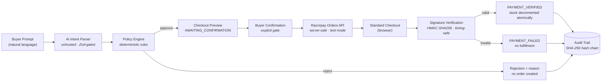

# AgentPay

**Safe AI checkout for the agentic web.** AgentPay turns buyer intent into bounded, explainable Razorpay test-mode transactions.

> **Razorpay Hackathon — Track 01: AI Growth & Agentic Commerce**

---

## Problem statement

AI buyers are about to shop on behalf of humans, but merchants have no safe way to let them pay:

- An LLM that can *directly* create orders or set prices is an untrusted actor holding the money keys.
- Buyers won't authorize agents they can't audit.
- Merchants need hard guarantees: no order without explicit consent, no payment without server-side verification, no silent policy violations.

## Solution overview

AgentPay is a merchant-side checkout agent with one rule baked into its architecture:

> **LLM proposes. Deterministic policy engine decides. User approves. Razorpay executes.**

A buyer types *"Buy two SQL Pro Interview Packs under ₹800"*. The LLM only extracts structured intent (SKUs, quantities, budget). A deterministic server-side policy engine validates it against the real catalog, recalculates every rupee from database prices in integer paise, and explains its decision. Nothing reaches Razorpay until the buyer clicks **Create test checkout**, and a payment is only "verified" after the server recomputes the Razorpay HMAC signature. Every step lands in a tamper-evident, hash-chained audit trail.

## Architecture



Every arrow into the audit store is append-only: `eventHash = SHA-256(previousHash | canonicalEvent)`.

## Product flow

1. Buyer submits natural language on `/buy`.
2. `POST /api/agent/interpret` → structured intent (`mode: "llm"` or `"fallback"`).
3. `POST /api/checkout/preview` → policy evaluation, server-calculated total, transparent explanation — or a machine-readable rejection.
4. Buyer reviews line items, total, remaining budget, and the policy checklist.
5. Buyer clicks **Create test checkout** → `POST /api/checkout/confirm` re-runs all policies against live inventory, then creates a Razorpay test-mode Order.
6. Razorpay Standard Checkout opens; the success callback posts to `POST /api/payments/verify`.
7. The server verifies the HMAC signature, marks `PAYMENT_VERIFIED`, and decrements stock atomically.
8. Every event above is hash-chained and viewable at `/audit/[sessionId]`.

## Safety model

| Stage | Who decides | Guarantee |
|---|---|---|
| Intent extraction | LLM proposes | Output must pass strict Zod schema; hallucinated SKUs discarded |
| Pricing | Code decides | Only DB catalog prices, integer paise, recomputed at preview *and* confirm |
| Approval | User confirms | No Razorpay order exists before an explicit click |
| Execution | Razorpay processes | Test-mode Orders API, amount from persisted session total |
| Settlement | Server verifies | HMAC-SHA256 + timing-safe compare before fulfillment |

The LLM can never decide price, bypass inventory, skip confirmation, create an order, or mark a payment successful.

## Features

- Natural-language purchase intent parsing (OpenAI-compatible LLM **or** deterministic local fallback with visible "AI fallback mode" badge)
- Deterministic policy engine with 13 machine-readable rejection codes
- Server-exclusive pricing in integer paise (₹399 = `39900`)
- Transparent checkout preview with human-readable policy explanations
- Explicit confirmation gate with duplicate-submission protection
- Application-level duplicate-order protection via canonical cart hashing
- Razorpay Standard Checkout (test mode) launched client-side after a valid Order
- Server-side signature verification with `timingSafeEqual`
- Tamper-evident, hash-chained audit trail with one-click chain verification
- Merchant catalog page + agent-readable `GET /api/catalog` JSON endpoint
- Graceful degradation: no Razorpay keys → "Demo payment mode unavailable", previews/rejections/audit still work; no OpenAI key → fallback parser

## Tech stack

Next.js 16 (App Router, Turbopack) · TypeScript (strict) · Tailwind CSS v4 · shadcn/ui · Prisma 7 + SQLite (driver adapter: `better-sqlite3`) · Zod 4 · Razorpay REST API · OpenAI-compatible chat completions · Lucide icons

## Local setup

```bash
npm install
npx prisma migrate dev     # creates SQLite db + applies migration
npx prisma generate        # generates the Prisma Client (v7: explicit)
npx prisma db seed         # seeds merchant, catalog, policy config
npm run dev                # http://localhost:3000
```

> Prisma 7 note: `prisma migrate` no longer auto-runs `generate`/`seed`, and the datasource URL lives in `prisma.config.ts`.

## Environment variables

Copy `.env.example` to `.env`:

```bash
DATABASE_URL="file:./dev.db"
NEXT_PUBLIC_APP_URL="http://localhost:3000"
RAZORPAY_KEY_ID="rzp_test_xxxxxxxxx"
RAZORPAY_KEY_SECRET="xxxxxxxxx"
OPENAI_API_KEY=""            # optional — empty uses local fallback parser
OPENAI_MODEL="gpt-4o-mini"   # optional
```

Both integrations degrade gracefully when keys are empty.

## Testing Razorpay test mode

1. Get test keys from the [Razorpay Dashboard](https://dashboard.razorpay.com) → Settings → API Keys (Test mode).
2. Put them in `.env`, restart `npm run dev`.
3. On `/buy`, run the success prompt below and confirm.
4. In the Razorpay test window, use [test card `4111 1111 1111 1111`](https://razorpay.com/docs/payments/payments/test-card-details/), any future expiry/CVV, or the test UPI IDs.
5. Watch the status move through *Payment submitted → Verifying payment → Payment verified*, then inspect the full audit trail.

Without keys, confirm shows **"Demo payment mode unavailable"** — previews, rejections, and audit still function.

## Demo prompts

| Prompt | Outcome |
|---|---|
| `Buy two SQL Pro Interview Packs under ₹800` | Approved — ₹798.00 total, ₹2.00 under budget |
| `Get the Next.js Backend Pack` | Approved — ₹499.00 |
| `Buy three SQL Pro Packs under ₹800` | Rejected — `BUDGET_EXCEEDED` |
| `Buy the Premium Interview Bundle` | Rejected — `OUT_OF_STOCK` |

## Failure scenarios

1. **Budget exceeded** — three SQL packs cost ₹1,197.00 > ₹800.00 budget. Policy rejects, session becomes `REJECTED`, **no Razorpay order is created**, UI states "No payment action was taken.", audit records `POLICY_REJECTED`.
2. **Out of stock** — Premium Interview Bundle has stock 0. Rejected pre-payment with `OUT_OF_STOCK`; UI says "This item is currently unavailable. No payment action was taken."
3. **Duplicate confirmation** — confirming twice (or previewing the same cart again) reuses the existing active session/order via cart-hash match; UI shows "Existing secure checkout reused; no duplicate order was created."
4. **Forged callback** — any tampered `razorpay_signature` fails HMAC verification → `PAYMENT_FAILED`, stock untouched, `PAYMENT_SIGNATURE_REJECTED` recorded.

## Audit trail design

- Every meaningful transition emits an `AuditEvent`: timestamp, actor (`BUYER | AGENT | POLICY_ENGINE | SYSTEM | RAZORPAY`), event type (17 types from `INTENT_RECEIVED` to `PAYMENT_MARKED_FAILED`), human-readable summary, structured JSON payload.
- Chain: `eventHash = SHA-256(previousHash ?? "" | canonicalJson(sessionId, eventType, actor, payload))`. Canonicalization sorts keys recursively so serialization is deterministic. Timestamps are excluded from hashed material to avoid datetime-precision instability; content tampering and deletion still break every subsequent link.
- `/audit/[sessionId]` renders the timeline, expandable payloads, copyable hashes, and an **Audit integrity** card backed by `verifyHashChain` (also exposed at `GET /api/audit/[sessionId]`).
- Payloads are sanitized against secret-looking keys as defense-in-depth; secrets never enter audit records.

## Application-level duplicate protection

The Razorpay Orders API does not support an idempotency header, so AgentPay enforces idempotency itself:

1. Cart items are normalized (sorted by SKU, SKU+quantity only) with policy version and buyer budget folded in.
2. The canonical object is serialized deterministically and SHA-256 hashed → `cartHash`.
3. Before creating an order, the service looks for an existing non-terminal session with the same `cartHash`; if one holds a Razorpay order, that order/session is returned instead of creating another.
4. Each new session gets a unique `idempotencyKey`; the confirm button disables while submitting; confirmation-time policy re-checks run inside DB transactions.

## Project structure

```
src/
  app/                    # pages + API route handlers
    api/{agent,catalog,checkout,payments,audit}/...
    buy/  merchant/catalog/  audit/[sessionId]/  architecture/
  components/
    agent/    # chat, intent card, preview, checklist, confirmation, payment status
    audit/    # timeline + integrity card
    catalog/  shared/  ui/
  lib/
    agent/      # intent-parser (LLM adapter), fallback-parser
    audit/      # hash-chain, audit-service
    checkout/   # cart-hash, policy-engine, checkout-service
    razorpay/   # REST client, order service, verify-signature
    env.ts money.ts db.ts rate-limit.ts hash-utils.ts
  schemas/      # Zod: agent.ts checkout.ts payment.ts
prisma/         # schema.prisma, seed.ts, migrations/
scripts/        # verify-security-logic.ts (chain + HMAC self-tests)
```

## Known limitations & next steps

- Single merchant, single buyer, no auth — by design for the MVP scope.
- In-memory rate limiter and audit-chain writes are per-instance; production would use Redis and transactional outbox patterns.
- Razorpay webhook handling (`payment.captured`) is not implemented; verification relies on the browser callback reaching the server.
- Stock decrements only on verified payment; abandoned `ORDER_CREATED` sessions need an expiry sweeper (`EXPIRED` status exists but nothing transitions to it yet).
- LLM intent parsing supports one OpenAI-compatible provider; multi-provider routing and streaming are future work.

## Screenshots

<!-- _Placeholder: add screenshots of /buy approval flow, rejection states, and /audit/[sessionId] timeline._ -->

## Disclaimer

**This project uses Razorpay Test Mode. No real money is processed.**
