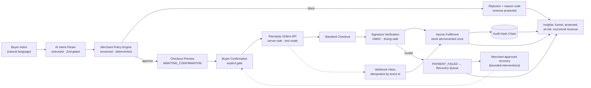

# AgentPay — Commerce Control Plane

**The control plane for safe AI commerce.** AgentPay lets businesses safely expose products to AI buyers, control autonomous purchase behavior, recover failed payment intent, and measure the revenue impact of agentic commerce.

> **Razorpay Hackathon — Track 01: AI Growth & Agentic Commerce**

**Positioning:** AI agents can discover, recommend, and prepare purchases. They cannot spend money, create a payment order, or fulfil inventory without deterministic merchant controls and a verifiable event trail.

---

## What makes AgentPay different?

- **AI proposes but cannot spend.** The LLM only extracts intent through a strict Zod schema; it never sets prices, overrides inventory, creates orders, or declares success.
- **Merchants define machine-enforceable commerce policies.** Versioned rules bound order value, quantity, catalog access, agent authority and budgets — evaluated deterministically on every preview *and* confirmation.
- **Every payment is server-verified.** Browser popup "success" proves nothing; HMAC-SHA256 signatures are recomputed server-side with timing-safe comparison.
- **Webhook events are idempotent.** A signature-verified inbox keyed by event id means the same payment can never update inventory twice.
- **Unsafe revenue is prevented, not merely detected.** Out-of-policy carts are blocked before a payment screen exists — and the prevented value is measured.
- **Recoverable revenue gets bounded, merchant-approved intervention.** Failed intent is recovered through deterministic rules with stopping limits — no spam, no dark patterns.
- **Every decision is auditable.** A SHA-256 hash chain makes history tamper-evident; one click re-verifies it.

## Architecture



## Product surfaces

| Surface | Route | Audience |
|---|---|---|
| Agent Checkout | `/buy` | Buyer / AI agent |
| Merchant Overview | `/merchant` | Merchant |
| Catalog (+ access controls) | `/merchant/catalog` | Merchant |
| Policy Studio + Simulator | `/merchant/policies` | Merchant |
| Revenue Opportunities | `/merchant/insights` | Merchant |
| Recovery Queue / Case detail | `/merchant/recovery`, `/merchant/recovery/[caseId]` | Merchant |
| Audit Trail (list + per session) | `/merchant/audit`, `/audit/[sessionId]` | Both |
| Buyer recovery page | `/recover/[caseId]` | Buyer (simulated) |
| Architecture | `/architecture` | Everyone |

## Payment safety model

| Stage | Who decides | Guarantee |
|---|---|---|
| Intent extraction | LLM proposes | Strict Zod schema; hallucinated SKUs discarded |
| Pricing & eligibility | Code decides | DB prices in integer paise, recomputed at preview *and* confirm |
| Approval | User confirms | No Razorpay order exists before an explicit click |
| Execution | Razorpay processes | Test-mode Orders API, amount from persisted session total |
| Settlement | Server verifies | Checkout HMAC **and** idempotent webhook inbox |
| Fulfilment | One atomic transaction | Guarded stock decrement rolls back on any race |

## Merchant policy engine

Policies are **versioned rows** (`MerchantPolicy.policyVersion`); every save creates a new immutable version, supersedes the old one, and appends `POLICY_CHANGED` (old values, new values, actor) to the global audit chain. Historical checkouts are never re-evaluated.

Enforced rule families:

1. **Transaction:** max order value, max quantity per item, max items per cart, confirmation gate, currency, session expiry minutes.
2. **Catalog access:** per-product *discoverable / purchasable / paused* toggles, per-product AI quantity caps. Hidden products vanish from `GET /api/catalog`; paused/human-only products reject with `CATALOG_ACCESS_PAUSED` / `AGENT_PURCHASE_NOT_ALLOWED`.
3. **Agent authority:** recommend / prepare-checkout / bundle-discount toggles. Autonomous payment execution is hard-disabled by design.
4. **Budgets:** default buyer budget, max agent-proposed cart value, extra-confirmation threshold, daily test-mode cap.
5. **Risk & recovery:** attempts per session, checkouts per cart hash, cooling-off windows, low-stock review threshold, recovery enablement + attempt cap.

Rejection codes include the exact responsible control, e.g. `catalog_access.paused`, `budget.daily_test_mode_cap`.

### Policy simulator

`POST /api/merchant/policy/simulate` dry-runs seeded scenarios against the current policy and names the blocking control. Simulations create **no sessions and no orders** (covered by tests).

## Opportunity analytics definitions

- **Revenue verified** — Σ totals of `PAYMENT_VERIFIED` sessions.
- **Revenue protected** — Σ attempted cart values of policy rejections (budget, stock, quantity, access). Successful payments are never counted here.
- **Revenue at risk** — Σ totals of failed / expired / abandoned-after-confirmation sessions eligible for recovery.
- **Recovery conversion rate** — recovered cases ÷ recovery-eligible cases.
- **Funnel** — intent received → cart previewed → buyer confirmed → order created → payment verified, with per-stage conversion and drop-off.

## Revenue recovery flow

1. Deterministic scan maps failed/expired/abandoned/budget-blocked/out-of-stock sessions onto one bounded intervention (`src/lib/recovery/intervention-engine.ts` — pure rules, no LLM).
2. Cases enter the queue as proposals (`RECOVERY_CASE_CREATED`, `RECOVERY_PROPOSED`).
3. **Nothing contacts the buyer until a merchant approves.** Approval executes an in-app simulation with guardrail-checked copy (`RECOVERY_APPROVED`, `RECOVERY_EXECUTED`).
4. The buyer sees `/recover/[caseId]`: resume original checkout, accept an allowed alternative, or decline.
5. Any resumed checkout re-runs the full pipeline — policies, explicit confirmation, test-mode order, signature verification/webhooks, atomic fulfilment — then closes the loop (`RECOVERY_SUCCEEDED`).
6. Stopping rules: ≤ 2 attempts (policy-configurable), merchant kill-switch, closed cases immutable, stock must satisfy the request, 14-day case window.

## Webhook idempotency model

`POST /api/webhooks/razorpay` verifies HMAC-SHA256 over the **raw body**, stores each delivery in a `WebhookEvent` inbox keyed by `x-razorpay-event-id`, and answers redeliveries with `{duplicate: true}` without re-processing. Captured payments are amount-checked against the policy-approved total before sharing the same atomic fulfilment transaction as the browser-callback path.

## Audit hash-chain model

`eventHash = SHA-256(previousHash ?? "" | canonicalJson(sessionId?, eventType, actor, payload))`. Session events form per-session chains; merchant-level events (policy changes, simulations) form a global chain. Canonicalization sorts keys recursively. Timestamps are excluded from hashed material to avoid datetime-precision instability — content tampering or deletion still breaks every later link. Payloads pass a secret-redaction filter as defense-in-depth.

## Testing strategy

```bash
npm run test          # 113 unit + integration tests (Vitest)
npm run typecheck     # tsc --noEmit (strict)
npm run lint          # eslint
npm run build         # production build
npm run test:security # standalone chain-tamper + HMAC self-tests
```

Integration tests run against an isolated `prisma/test.db` (fresh migrations via `tests/global-setup.ts`) with a **mocked Razorpay gateway**. Coverage highlights: every rejection code incl. new access/daily-cap rules; duplicate-confirmation race (3 concurrent confirms → exactly 1 order); forged signatures; webhook replay dedup; policy versioning + simulation purity; funnel/revenue math in paise; full recovery lifecycle incl. stopping rules and "duplicate webhook cannot fulfil twice"; recovery-copy guardrails (no invented prices, urgency, discounts, or payment-status claims).

## Local development

```bash
npm install
npx prisma migrate dev && npx prisma generate && npx prisma db seed
npm run dev            # http://localhost:3000
```

Environment (see `.env.example`): `DATABASE_URL`, `NEXT_PUBLIC_APP_URL`, `RAZORPAY_KEY_ID`/`RAZORPAY_KEY_SECRET` (test keys; empty → "Demo payment mode unavailable"), `RAZORPAY_WEBHOOK_SECRET` (optional), `OPENAI_API_KEY`/`OPENAI_MODEL` (optional; empty → deterministic fallback parser and template recovery copy).

Demo data: `npx prisma db seed` rebuilds 40+ synthetic sessions, recovery cases across all lifecycle stages, and webhook evidence. `POST /api/merchant/demo/reset` does the same at runtime.

## Threat model (summary)

| Threat | Mitigation |
|---|---|
| LLM invents prices/SKUs or exceeds authority | Zod-gated intent; SKU allowlist; policy engine recomputes everything |
| Client tampers with totals/stock/status | All money state read from DB; requests carry only SKUs/quantities/session ids |
| Forged payment callback | Server-side HMAC + timing-safe compare; order-id binding to session |
| Replayed/duplicated gateway events | Idempotent webhook inbox keyed by event id |
| Double-submit confirmation | Atomic status claim + cart-hash reuse |
| Runaway recovery messaging | Stopping rules, attempt caps, merchant approval gate, DO_NOT_CONTACT fallback |
| History rewriting | Hash-chained audit events; one-click chain verification |
| Secret leakage | Secrets server-only; audit payload redaction; key ID is the only credential in browser payloads |

## Known limitations

- Single merchant, single buyer, no auth ("Merchant Demo Admin" is hardcoded) — MVP scope.
- In-memory rate limiter; SQLite local store; recovery actions are simulated (no email/SMS/WhatsApp).
- Abandoned `ORDER_CREATED` sessions need an expiry sweeper beyond the resume-time check.
- Bundle-discount authority toggle exists but discount application itself is future work.
- Production roadmap: PostgreSQL + backups, Redis rate limiting, stock reservation with expiry, structured logs/trace IDs, RBAC auth, secret manager, real messaging channels behind compliance review.

## Disclaimers

**This project uses Razorpay Test Mode. No real money is processed.**
**All historical/analytics data shipped in seeds is explicitly synthetic demo data.**
No PCI-compliance, production-readiness, or real-money claims are made.
